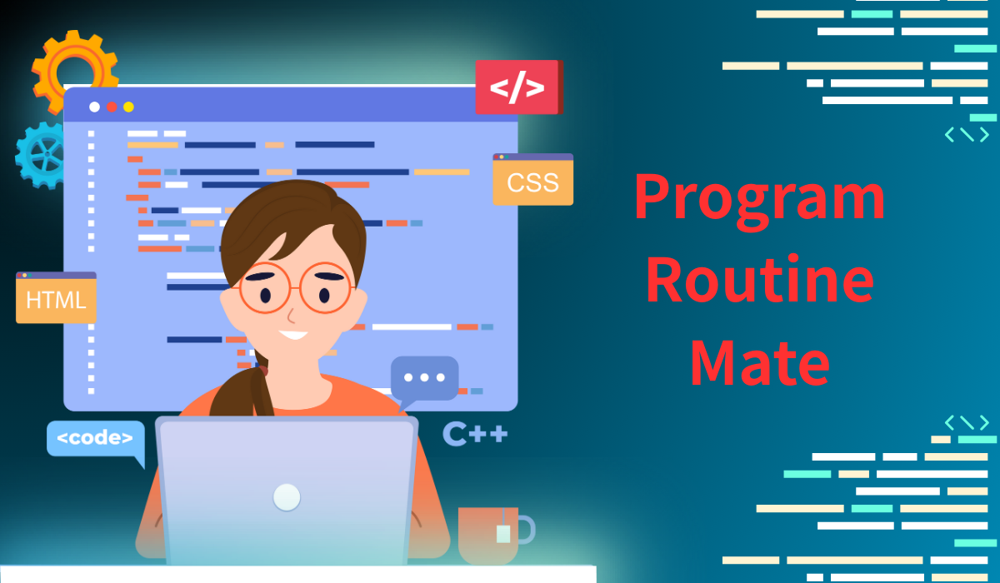

# ProgramRoutineMate

サービス URL :[ProgramRoutineMate](https://program-routine-mate.com/)

## ▪️ サービス概要

[ProgramRoutineMate]は、Web 上で初学者がプログラミング学習を他のユーザーと共有、楽しみながら習慣化できるサービスです。
学習継続によるバッジ獲得機能、ランキング戦と楽しめるよう要素があります。
学習記録を投稿した際に、学習記録を基に AI が問題を作成してくれます。
また、1 つずつ習慣化しながら学習できる仕組みになっています。

## ▪️ このサービスへの思い・作りたい理由

私は、未経験から2年間ほど IT 業界に従事してました。
IT 業界のSESエンジニアをしているときは、黙々と個人で業務に必要なプログラミング学習をしていました。  
その後、退職して、RUNTEQ というプログラミングスクールに入学しました。
このスクールは、とてもコミュニティーが盛んであり、
MattermostやDiscodeというコミュニケーションサービスを使って  
他の人の頑張りを見たり、記録を共有することで
黙々と学習していた時よりも学習が捗り、楽しくプログラミング学習を今でも続けられております。
卒業後も上記のような環境で学習を継続したいと
同時にRUNTEQ生以外の人たちとも学習を共有したいなと思い始めるようになり、
上記のアプリの制作を始めました。

## ▪️ ユーザー層について

- 1 人ではモチベーションが上がらず、なかなかプログラミング学習を続けられない初学者の人
  他の人の投稿を確認できたり、自分の投稿にいいね、コメントなどの共有などの楽しく学習のサポートします。

- 1 つずつ着実に学びながらプログラミング学習を習慣化したい初学者の人
  プログラミング学習は、本当にやるべき学習がたくさんあります。
  (例 プログラミング言語(Ruby など)、フレームワーク(RubyonRails など)、HTML、CSS、JavaScript、SQL、git、 Docker などそれ以上にまだまだ、たくさんあります。
  初学者がいきなり幅広く上記の学習を行うとプログラミング学習の継続が難しくなる可能性が考えられるので、
  3 週間(習慣化するには、3 週間かかると言われるので)を目安に 1つ1つ着実に習慣化を目指し、上記の必要な学習の習慣化のサポートをします。
  
- 学習の継続を視覚化したい初学者の人
  gitHub にある Contribution Graph をこのWeb サービスにも用意されており、学習記録をしっかり把握でき、視覚化によっての学習継続の振り返りのサポートをします。
  
- 楽しくプログラミング学習を継続したい初学者の人
  ただ、学習記録を投稿するでは、モチベーションが上がらないと思われるので、学習継続によるバッジを獲得、学習継続のランキング戦、学習記録からAIが問題を提供など
  プログラミング学習を色々な角度から学習を楽しめるをサポートします。

## ▪️ サービスの利用イメージ

- ジャンルの設定(初回)
  初めて、学習記録を投稿する場合、先に自分が取り組みたいジャンルを設定できます。。
  学習記録を投稿する前に学習ジャンルの画面からジャンルを変更することも可能です。

- 学習記録の投稿(ジャンル設定済み)
  その設定したジャンルに応じて、学習内容、画像、学習内容から学んだことを記入して投稿できます。
  21 日間設定したジャンルの学習記録を投稿します。
  設定後学習記録を投稿して、途中、他の学習ジャンルを変更した場合は、学習ジャンルの画面から変更可能です。(投稿された学習記録は、画面から消えませんが、また、1 からの学習記録の投稿になります。)

- 設定した学習記録の投稿(21 日達成)
  以前の学習ジャンルが設定されたまま、また、新しいジャンルの追加設定が画面に表示されて、そのジャンルを設定すると、
  以前のジャンルと並行で新しいジャンルの学習記録を21日間投稿をします。(最大3つまで)

- 学習記録の投稿後、 AIが問題を作成、チャレンジ
  　学習記録を投稿する際に、学習ジャンル、学習内容、学習内容から学んだことから AIが分析して、問題を作成し、挑戦できます。

- 学習記録のコメント、いいね
  学習記録をクリックするといいね、コメントをすることができます。自分の記録は、TwiiterでのShareもできます。(他のユーザー学習記録ににコメント、いいねすると通内アイコンに通知が来ます。(LINE ログインしている場合、LINEにも通知が来ます。)
- 学習記録の検索
  ジャンル、学習内容から、投稿された学習キロの検索して、拝見したい学習記録を探せます。
- Contribution Graph、学習カレンダー、通知
  学習記録を投稿すると ContributionGraphに色がつきます
  学習カレンダーで学習開始時間と学習終了時間を設定して、時間を長く勉強するほど、緑のカラーが濃くなります
  設定した学習開始時間と学習終了時間は、ヘッダーの通知アイコンに来て、クリックすると通知メッセージが見れます。(LINE ログインの場合、LINE からもメッセージが見れます。)

- グラフと Wikipedia によるジャンルの概要
  ジャンル設定画面から設定しているジャンルをクリックすると
  WikiPediaによるそのジャンルについて知れたり、
  自分の学習継続をグラフで確認できたり、
  メニューバーの中にある、ジャンル一覧から他の人の学習ジャンルを見て、何を学習すれば良いか困った時に参考できます。
- 学習バッジ獲得
  学習記録を投稿し続けるとバッジが手に入ります。(バッジアイコンが手に入ると通知アイコンにメッセージが来ます。(LINEログインの場合も上記と同様。)

- 学習継続によるランキング戦
  日別ごとに学習記録を投稿するとユーザーがランキングに表示され、ランキンの順位が変わります、
  同じ順位の場合、同率となります。

## ▪️ ユーザーの獲得・宣伝方法

プログラミングスクールに通っていて、
初学者が多いのでそこからユーザー獲得

## ▪️ サービスの差別化ポイント・推しポイント

- 3 週間(21 日)ごとに新しい取り組み(ジャンル)を追加できる。
  習慣には、3 週間かかると言われているので、まず、1 つのジャンルを設定して 21 日間学習記録を確認できれば、次の取り組み(ジャンル)を追加できるようにすることで、手を広げすぎて学習捗らないというリスクを防げます。
  
- Contribution Graph などのグラフの多様性、視覚化
  スクール内で知り合いにインタビューすると学習した形跡などの視覚化があったほうが良いと言う意見が多かったので、多くの視覚化を入れて、学習継続のモチベーション維持しやすい仕組みとなっています。
  
- バッジ獲得、ランキング戦、AI からの問題にチャレンジ
  ただ、学習記録を投稿し続けるだけでなく、　上記のような多様なゲーム要素を入れて、楽しくプログラミング学習をすることがで来ます。

- 通知機能の多彩性
  学習開始時間と学習終了時間を設定して、設定したユーザーだけに来るだけでなく、
  他のユーザーにも
  そのユーザーが学習を開始しました。と知らせてくれます。
  そうすることでやる気にさせたり、仲間と学習してる気分にさせてくれます。
  
  

## ■ 機能紹介

| 会員登録・ログイン                                                                                                                          | 投稿一覧                                                                                                                                                         |
| ------------------------------------------------------------------------------------------------------------------------------------------- | ---------------------------------------------------------------------------------------------------------------------------------------------------------------- |
|  |                   |
| **devise**を用いて、標準的なメールアドレス/パスワード認証に加え、Google ログインと LINEログインとGitHubログイン機能を実装しました。      | 投稿した学習記録は、一覧に表示されます。**ransack とオートコンプリート機能かつマルチ検索**で検索機能を実装しており、学習ジャンルと学習内容で絞って検索できます。 |

| ジャンル・記録                                                                                                                             | 学習カレンダー                                                                                                                                                                               |
| ------------------------------------------------------------------------------------------------------------------------------------------ | -------------------------------------------------------------------------------------------------------------------------------------------------------------------------------------------- |
|                                       |                                                                                           |
| 学習ジャンルを設定して、21 日間そのジャンルに応じた学習記録を投稿します。投稿した際に学習記録に基づき、AIが問題を作成してくれます。 | 学習カレンダーの日付をクリックするとその日に学習開始時間と学習終了時間を設定して、アプリ内でリアルタイムで通知メッセージが来ます。LINE ログインで友達追加している場合、LINE通知も可能です。 |

| ジャンル詳細                                                                                           | ジャンル一覧                                                                                                                                   |
| ------------------------------------------------------------------------------------------------------ | ---------------------------------------------------------------------------------------------------------------------------------------------- |
|  |  |
| 設定しているジャンルを WikiPedia で詳細に確認できたり、投稿記録を確認できます。                        | ジャンル一覧では、　ユーザーが何のジャンルの学習をしているか把握することができ、何を学習すべきか困った時に参考できます。                       |

| バッジ獲得                                                                                                                                | ランキング戦                                                                                                                                |
| ----------------------------------------------------------------------------------------------------------------------------------------- | ------------------------------------------------------------------------------------------------------------------------------------------- |
|  |  |
| 継続的に学習記録を投稿するとバッジが獲得できます。                                                                                        | 学習継続によるランキング戦で他のユーザーと学習継続の競い合いができます。                                                                    |

## 使用技術

| カテゴリ       | 技術                                                                     |
| -------------- | ------------------------------------------------------------------------ |
| フロントエンド | Rails 7.2.2 / TailwindCSS/ Hotwire                                       |
| バックエンド   | Rails 7.2.2 (Ruby 3.2.3)                                                 |
| データベース   | PostgreSQL                                                               |
| 開発環境       | Docker                                                                   |
| インフラ       | Render / Amazon S3                                                       |
| 認証           | Devise / Google認証 / LINE認証 / GitHub認証                           |
| 非同期処理     | ActionCable / Redis / Sidekiq                                            |
| ライブラリ     | Cal-Heatmap.js / Chart.js / FullCalendar.js                              |
| API            | LINE Messaging API / OpenAI API / Wikipedia REST API / Google Sheets API |
| VCS            | GitHub                                                                   |
| CI/CD          | GitHub Actions                                                           |
| テスト         | RSpec                                                                    |

## 画面遷移図

Figma: https://www.figma.com/design/l76ZQiTKnKvVSaeN2Gx7GI/Program-Routin-Mate-%E7%94%BB%E9%9D%A2%E9%81%B7%E7%A7%BB%E5%9B%B3?node-id=0-1&p=f&t=WXJwUnWwraNNPRDn-0

## ER 図

