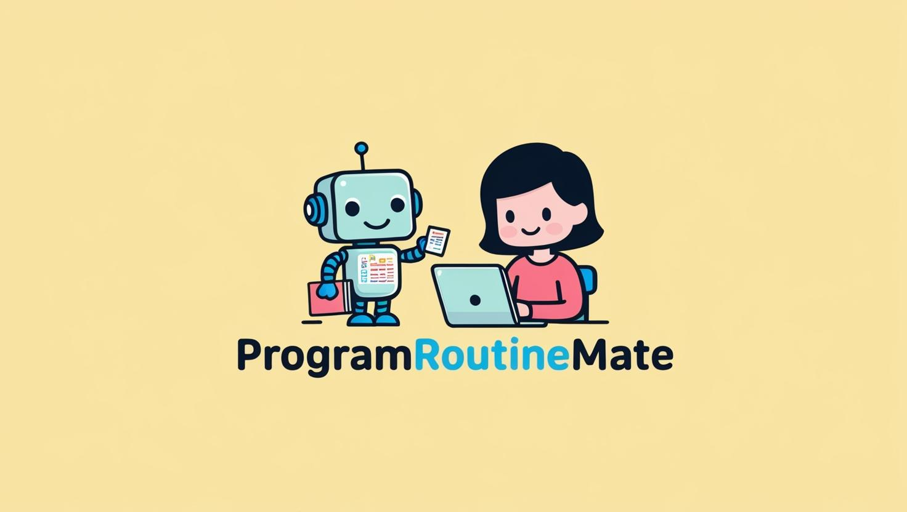

サービス URL :[Program-Routine-Mate](https://program-routine-mate.com/)

## ▪️ サービス概要

[Program-Routine-Mate]は、プログラミング初学者が仲間と学習を楽しく継続できるサービスです。
学習記録を投稿すると、他のユーザーからコメントや応援が届き、通知機能で繋がりを感じられます。
さらに、学習継続日数に応じたランキング機能や、投稿内容をもとにAIが自動生成する練習問題など、
モチベーションを高める仕組みを多数搭載。
一歩ずつ習慣化しながら、仲間と一緒にプログラミングスキルを伸ばせます。

## ▪️ このサービスへの思い・作りたい理由

私は未経験から約2年間、IT業界でシステムエンジニアとして働いていました。
当時は、業務に必要なスキルを身につけるため、一人で黙々とプログラミング学習をしていました。

その後、退職してプログラミングスクール「RUNTEQ」に入学しました。
RUNTEQではコミュニティが非常に活発で、MattermostやDiscordを通じて他の受講生の学習記録や努力を共有し合うことができます。
この環境で学習するうちに、一人で学んでいた頃よりも大きくモチベーションが高まり、今でも楽しく学習を継続できています。

この経験から、「コミュニティの力で学習は加速し、継続しやすくなる」と強く実感しました。
卒業後も同じような環境で学習を続けたい、さらにRUNTEQ生以外の人ともつながりたいという思いから、このサービスの開発を始めました。

## ▪️ ユーザー層について

- 一人では学習が続かない初学者
  - 他のユーザーの学習記録を閲覧したり、いいね・コメントで交流することで、学習のモチベーションを高められます。

- 着実に習慣化したい初学者
  - 幅広い分野（例：Ruby、Rails、HTML、CSS、JavaScript、SQL、Git、Dockerなど）を一度に学ぶのは挫折の原因になりがちです。
    本サービスでは、1つの分野を3週間（習慣化の目安）ごとに取り組む仕組みで、無理なく習慣化を支援します。
- 学習状況を可視化したい初学者
  - GitHubのContributions Graphのように、学習記録をカレンダー形式で表示し、自分の継続状況を一目で把握できます。
- 学習を楽しみながら続けたい初学者
  - 継続日数に応じたバッジ獲得、ランキング機能、学習記録からAIが自動生成する問題など、ゲーム感覚で学習を継続できる仕組みを提供します。

## ▪️ サービスの利用イメージ

- 学習ジャンル設定
  - 初回投稿前に、自分が取り組むジャンル（例：Ruby、JavaScriptなど）を設定。
  途中でジャンル変更や追加（最大3つまで）も可能。

- 学習記録投稿
  - ジャンルごとに「学習内容」「画像」「学んだこと」を記録。
    1ジャンルにつき21日間継続投稿を目指す。
    投稿後、AIが学習内容を分析し、自動で練習問題を生成。すぐ挑戦可能。

- ユーザー交流
  - 投稿に「いいね」や「コメント」が可能。
  - コメントすると相手に通知（LINEログイン時はLINE通知も可）。
  - 自分の記録はTwitterでシェア可能。

- 学習の可視化
  - Contributions Graph：投稿日ごとに色がつく。学習時間が長いほど濃く表示。
    学習カレンダー：開始時間・終了時間を記録。
    通知機能：設定時間の開始・終了時にアラート（LINE連携可）。

- 情報・参考機能
  - ジャンル詳細ページでWikipediaの概要表示。
    グラフで学習継続状況を確認。
    他ユーザーのジャンル一覧から学習テーマを探せる。

- ゲーム要素
  - 継続日数に応じたバッジ獲得。
  - 毎日投稿でランキング戦に参加（同率順位あり）。
   

## ▪️ ユーザーの獲得・宣伝方法

　RUNTEQの学習仲間やTwitterでのshareによるユーザーの獲得

## ▪️ サービスの差別化ポイント・推しポイント

- 21日習慣化サイクル
  - 習慣化に必要と言われる3週間ごとに新しいジャンルを追加可能。
    一度に手を広げすぎず、着実にスキルを積み上げられる。
- 学習の徹底可視化
  - Contributions Graphやカレンダーなど、多様なグラフで学習状況を視覚化。
  - ユーザーインタビューでも「学習の見える化」が高評価。
- 楽しく続けられるゲーム要素
  - バッジ獲得、ランキング戦、AI生成の問題挑戦など、学習をエンタメ化。

- 多彩な通知機能でモチベ維持
  - 自分だけでなく他ユーザーの学習開始も通知（ブラウザ通知）。
    仲間と一緒に学んでいる感覚を醸成

## ■ 機能紹介

| 会員登録・ログイン                                                                                                                               | 投稿一覧                                                                                                                                                         |
| ------------------------------------------------------------------------------------------------------------------------------------------------ | ---------------------------------------------------------------------------------------------------------------------------------------------------------------- |
|       |                |
| **devise**を用いて、標準的なメールアドレス/パスワード認証を実装しました。さらに、**Google**と**LINE**と**GitHub** ログインにも対応し、ユーザーは好みの方法でスムーズにサインイン可能です。 | 投稿された学習記録は、一覧に表示されます。**ransack + オートコンプリート機能を組み合わせたマルチ検索**を搭載しました。学習ジャンルや学習内容で直感的に絞り込みができ、探したい記録を素早く見つけられます。 |

| ジャンル・記録                                                                                                                                           | カレンダー                                                                                                                                                                                                                                 |
| -------------------------------------------------------------------------------------------------------------------------------------------------------- | ---------------------------------------------------------------------------------------------------------------------------------------------------------------------------------------------------------------------------------------------- |
|                                                     |                                          |
| 学習ジャンルを設定し、21日間分の学習記録の投稿。学習内容を基に、**OPenAPI**を活用した AI自動的にが問題を生成し、すぐに挑戦可能です。 | 学習カレンダーの日付をクリックして、学習開始時間と学習終了時間を設定して、**Actioncable**によるアプリ内でリアルタイム通知で学習予定をお知らせします。また、LINEログイン済みで友達追加している場合、**LINE Messaging API**によるLINE通知も受け取れます。 |

| ジャンル詳細                                                                                                 | ジャンル一覧                                                                                                                                   |
| ------------------------------------------------------------------------------------------------------------ | ---------------------------------------------------------------------------------------------------------------------------------------------- |
|        |  |
| 設定した学習ジャンルについて **Wikipedia REST API**にを使って詳細な説明をアプリ内で閲覧可能できます。また、*Chart.js*を用いて学習記録の投稿数をグラフで確認できるため、モチベーション維持しながら学習を続けられます。| ジャンル一覧では、**Chart.js**によるユーザーが何のジャンルの学習をしているかをグラフで把握可能です。学習したいジャンルに迷った時の参考として活用できます。     |

| バッジ獲得                                                                                                                                | ランキング戦                                                                                                                                |
| ----------------------------------------------------------------------------------------------------------------------------------------- | ------------------------------------------------------------------------------------------------------------------------------------------- |
|  |  |
| 継続的に学習記録を投稿するとバッジを獲得できます。                                                                                        | 学習継続によるランキング戦で、他のユーザーと競い合いがらモチベーションを高められます。                                                                    |

## 使用技術

| カテゴリ       | 技術                                                                     |
| -------------- | ------------------------------------------------------------------------ |
| フロントエンド | Rails 7.2.2 / TailwindCSS/ Hotwire                                       |
| バックエンド   | Rails 7.2.2 (Ruby 3.2.3)                                                 |
| データベース   | PostgresSQL                                                               |
| 開発環境       | Docker                                                                   |
| インフラ       | Render / Amazon S3                                                       |
| 認証           | Devise / Google 認証 / LINE 認証 / GitHub 認証                           |
| 非同期処理     | ActionCable / Redis / Sidekiq/                                            |
| ライブラリ     | Cal-Heatmap.js / Chart.js / FullCalendar.js / Aos.js                           |
| API            | LINE Messaging API / OpenAI API / Wikipedia REST API / Google Sheets API |
| VCS            | GitHub                                                                   |
| CI/CD          | GitHub Actions                                                           |
| テスト         | RSpec                                                                    |

## 画面遷移図

Figma: https://www.figma.com/design/l76ZQiTKnKvVSaeN2Gx7GI/Program-Routin-Mate-%E7%94%BB%E9%9D%A2%E9%81%B7%E7%A7%BB%E5%9B%B3?node-id=0-1&p=f&t=WXJwUnWwraNNPRDn-0

## ER 図

